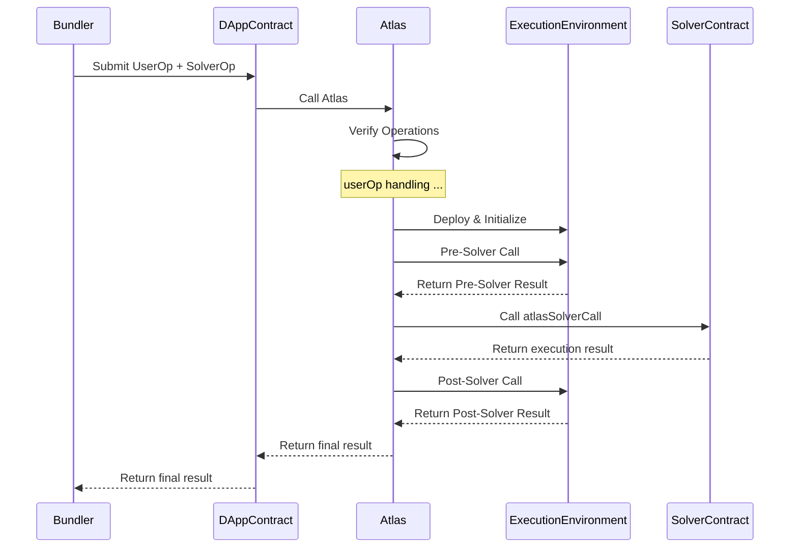

# Atlas Solver Example

This guide provides an overview of developing Solver contracts within the Atlas Protocol ecosystem. Solvers are essential components that execute operations, handle bid payments, and integrate decentralized applications (DApps) with the Atlas Protocol.

## Core Concepts

### SolverOperation Struct

The `SolverOperation` struct is the fundamental data structure that solvers must work with. It contains all the necessary information for executing an operation within the Atlas Protocol.

```solidity
struct SolverOperation {
    address from;
    address to;
    uint256 value;
    uint256 gas;
    uint256 maxFeePerGas;
    uint256 deadline;
    address solver;
    address control;
    bytes32 userOpHash;
    address bidToken;
    uint256 bidAmount;
    bytes data;
    bytes signature;
}
```

### Solver Interface

Solvers must implement the following interface:

```solidity
interface ISolverContract {
    function atlasSolverCall(
        address solverOpFrom,
        address executionEnvironment,
        address bidToken,
        uint256 bidAmount,
        bytes calldata solverOpData,
        bytes calldata extraReturnData
    ) external payable;
}
```

### Sequential Diagram of the Solver

The following diagram illustrates the key interactions between the Bundler, DAppContract, Atlas, ExecutionEnvironment, and SolverContract components in the Atlas Protocol ecosystem:



## Helper Base Contracts

The Atlas Protocol provides two helper base contracts that developers can inherit from to streamline the creation of Solvers:

### SolverBase

[`SolverBase`](../reference/solver/solver-base.md) is a foundational contract for Solvers designed to work with [`DAppControl`](../reference/dapp/dapp-control.md) contracts that have the `invertBidValue` flag set to `false`.

- Safety checks
- Escrow reconciliation
- Bid payment processing

#### Important Modifiers

The `SolverBase` contract includes two important modifiers that you should utilize in your `atlasSolverCall` function implementation:

1. `safetyFirst` Modifier:

```solidity
modifier safetyFirst(address executionEnvironment, address solverOpFrom) {
    if (msg.sender != _atlas) revert InvalidEntry();
    if (solverOpFrom != _owner) revert InvalidCaller();

    _;

    uint256 shortfall = IAtlas(_atlas).shortfall();

    if (shortfall < msg.value) shortfall = 0;
    else shortfall -= msg.value;

    if (msg.value > address(this).balance) {
        IWETH9(WETH_ADDRESS).withdraw(msg.value - address(this).balance);
    }

    IAtlas(_atlas).reconcile{ value: msg.value }(shortfall);
}
```

This modifier:

- Ensures that only the Atlas contract can call the function
- Verifies that the solver operation is from the authorized owner
- Handles any shortfall in the Atlas contract after the main function execution
- Unwraps WETH if necessary to cover the msg.value
- Reconciles the shortfall with the Atlas contract

2. `payBids` Modifier:

```solidity
modifier payBids(address executionEnvironment, address bidToken, uint256 bidAmount) {
    _;

    if (bidToken == address(0)) {
        // Pay bid in ETH
        if (bidAmount > address(this).balance) {
            IWETH9(WETH_ADDRESS).withdraw(bidAmount - address(this).balance);
        }
        SafeTransferLib.safeTransferETH(executionEnvironment, bidAmount);
    } else {
        // Pay bid in ERC20 (bidToken)
        SafeTransferLib.safeTransfer(bidToken, executionEnvironment, bidAmount);
    }
}
```

**This modifier:**

- Executes after the main function logic (note the `_;` at the beginning)
- Handles the payment of the solver's bid to the Execution Environment
- Supports payments in both ETH and ERC20 tokens
- Unwraps WETH if necessary to cover ETH payments
- Uses SafeTransferLib for secure token transfers

When inheriting from `SolverBase`, it's crucial to use these modifiers correctly in your `atlasSolverCall` function implementation to ensure proper security checks and bid payments.

### SolverBaseInvertBid

[`SolverBaseInvertBid`](../reference/solver/solver-base-inverted.md) extends the functionalities of [`SolverBase`](../reference/solver/solver-base.md) to support [`DAppControl`](../reference/dapp/dapp-control.md) contracts with the `invertBidValue` flag set to `true`. It introduces:

- Mechanisms for bid retrieval
- Support for inverted bid values
- Proper bid processing and allocation

## Developing a Solver

1. **Choose a Base Contract**:
   Decide whether to inherit from `SolverBase`, `SolverBaseInvertBid`, or implement the `ISolverContract` interface from scratch based on your DAppControl's configuration.

2. **Implement the ISolverContract Interface**:
   Override the `atlasSolverCall` function if using a base contract, or implement it as defined in the interface if starting from scratch.

3. **Handle SolverOperation Data**:
   Within the `atlasSolverCall` function, parse and process the `solverOpData` to execute the intended operation. This data contains the details of the solver operation to be performed.

4. **Manage Bid Payments**:
   Implement logic to handle bid payments as specified in the `SolverOperation` struct. If using a base contract like `SolverBase`, utilize the provided `payBids` modifier to handle bid payments automatically.

5. **Interact with the Execution Environment**:
   The Execution Environment is primarily used for bid payments, which is handled automatically by the `payBids` modifier in `SolverBase`. Direct interaction with the Execution Environment from within the solver is limited. The `executionEnvironment` address is provided mainly for this payment process.

6. **Error Handling**:
   Implement proper error handling and revert mechanisms to ensure the solver behaves correctly under various conditions. This includes handling potential failures in the solver's main logic and any interactions with external contracts.

7. **Gas Optimization**:
   Optimize your solver's gas usage to remain competitive in the bidding process. This involves writing efficient code and minimizing unnecessary operations or storage updates.

## Example: Inheriting from SolverBase

```solidity
contract MyCustomSolver is SolverBase {
    constructor(address weth, address atlasEscrow, address owner)
        SolverBase(weth, atlasEscrow, owner)
    {}

    function atlasSolverCall(
        address solverOpFrom,
        address executionEnvironment,
        address bidToken,
        uint256 bidAmount,
        bytes calldata solverOpData,
        bytes calldata extraReturnData
    )
        external
        payable
        override(SolverBase)
        safetyFirst(executionEnvironment, solverOpFrom)
        payBids(executionEnvironment, bidToken, bidAmount)
    {
        // Custom solver logic here
        (bool success,) = address(this).call{value: msg.value}(solverOpData);
        if (!success) revert SolverCallUnsuccessful();
    }
}
```


## Deployment

For detailed deployment instructions and best practices, please refer to the [Deployment Guide](./DEPLOYMENT.md).

The deployment guide covers:

- Local development setup with Anvil
- Setting up secure deployment keys 
- Deploying to Mumbai testnet and Polygon mainnet
- Security best practices for managing keys and environment variables

